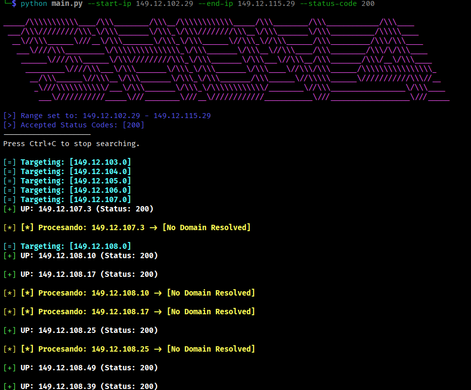

# simple-HTTP-discovery-v4 (SHDv4) 🚀

A high-performance, asynchronous IPv4 HTTP discovery tool written in Python. Designed to scan massive IP ranges efficiently using a thread-pool executor with backpressure control to keep memory usage flat.


## ✨ Features

* **DNS Resolution:** Integrated reverse DNS lookups for discovered targets.
* **Real-time Logging:** Asynchronous file writing via a dedicated worker thread.

> 

## 🛠️ Installation

1. **Clone the repository:**
   ```bash
   git clone [https://github.com/tu-usuario/simple-HTTP-discovery-v4.git](https://github.com/tu-usuario/simple-HTTP-discovery-v4.git)
   cd simple-HTTP-discovery-v4
   ```
Install dependencies:
```bash
pip install requests
```

🚀 Usage

Run the script from the src directory:
```bash
python main.py --start-ip 8.8.8.0 --end-ip 8.8.8.255 --status-code 200 301
```

Arguments:

* `--start-ip`: Starting IPv4 address.
* `--end-ip`: Ending IPv4 address.
* `--status-code`: One or more HTTP status codes to consider as "found" (e.g., 200 301 403).

📁 Project Structure
```plaintext
simple-HTTP-discovery-v4/
├── logs/               # Scan results (log.txt)
├── src/
│   ├── main.py         # Main logic & Threading control
│   ├── v4colors.py     # ANSI Color constants & formatting
│   ├── v4logger.py     # Async file writer worker
│   └── v4parser.py     # CLI argument parsing & IP math
└── README.md
```

⚙️ Technical Architecture

This tool implements a Producer-Consumer pattern with a Bounded Semaphore.

* **Producer**: The IP generator yields targets one by one.
* **Semaphore**: Blocks the producer if there are more than double the threads active tasks.
* **Workers**: Threads process HTTP requests and Reverse DNS.
* **Logger**: A dedicated thread handles I/O operations to prevent disk-writing from slowing down the network scan.

⚠️ Disclaimer

Scanning networks you do not own or have explicit permission to test may be illegal.

📄 License

Distributed under the MIT License.